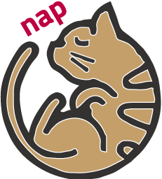

<p align="center">
  
</p>

[](https://zenodo.org/badge/latestdoi/20047602)

# What's nap
**Nagoya Atomistic-simulation Package (nap)** includes the following programs and utilities:
- parallel molecular dynamics simulation (*pmd*)
- potential parameter fitting (*fitpot* for neural-network potential, and for other potentials, see [optzer](https://github.com/ryokbys/optzer))
- python modules for pre/post-processes (*nappy*)

The program, *pmd*, includes various interatomic potentials for metals and semiconductors,
and uses spatial decomposition technique for the parallelization, and linked-cell method for efficient neighbor search.

# Who made this?
* [Ryo KOBAYASHI](http://ryokbys.web.nitech.ac.jp/index.html)
* An associate professor at Department of Physical Science and Engineering, Nagoya Institute of Technology, Japan.

# Requirements and dependencies

To compile *pmd* and *fitpot*, the following programs/libraries are required:

- Fortran compiler
- MPI library

*nappy* requires the following packages:

- *numpy*
- *scipy*
- *pandas*
- *docopt*
- *ASE*


# Compilation and usage

For the short test, whether or not you can use this program in your environment,

```bash
$ git clone https://github.com/ryokbys/nap.git ./nap
$ cd nap/
$ ./configure --prefix=$(pwd)
$ make test
```

If it works, you can use this program in your system.
To install the python package *nappy*, run the following commands on `nap/` top directory,

```shell
$ python -m build
$ pip install -e .
```

Then you can use the nappy commands, `napsys`, in the terminal and can import `nappy` package in python programs.

For details, please see the [documentation](http://ryokbys.web.nitech.ac.jp/contents/nap_doc_jp) (in Japanese) or ask me via e-mail (kobayashi.ryo[at]nitech.ac.jp).

# Acknowledgements
This program was supported in part by ["Materials research by Information Integration" Initiative (MI2I)](http://www.nims.go.jp/MII-I/) project of the Support Program for Starting Up Innovation Hub from Japan Science and Technology Agency (JST).


# LICENSE
This software is released under the MIT License, see the LICENSE.
