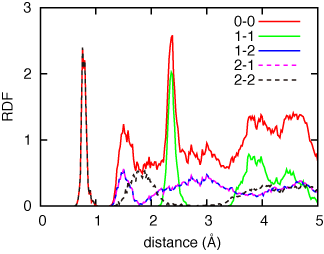

==============================
Analyzing simulation results
==============================

  #. :ref:`energy`
  #. :ref:`visualize`
  #. :ref:`CNA`
  #. :ref:`voronoi`
  #. :ref:`rdf`
  #. :ref:`adf`
  #. :ref:`power-spectrum`

--------

.. _energy:

Evolution of energies
========================
Energies are basic values in MD.
If you perform *NVE* simulation in which no damping, temperature control, nor external forces,
the total energy has to be conserved whereas kinetic and potential energies fluctuate.
This is often used to check the validity of forces on atoms when programming new potentials.

When one performs structure relaxation by damping velocities of atoms,
as MD steps increase the kinetic energy has to decrease to zero.

When one performs constant temperture simulation, 
kinetic energy should be almost constant during the simulation.

Since total, kinetic, and potential energies are written in ``out.erg`` file,
users can plot energy evolution using ``gnuplot`` command as,
::  

  $ gnuplot
  gnuplot> plot 'out.erg' us 1:2 w l, 'out.erg' us 1:3 w l, 'out.erg' us 1:4 w l

Or copy ``util/gp.erg`` script to the working directory and,
::

  gnuplot> load 'gp.erg'

--------

.. _visualize:

Visualization of atom configuration
==============================================
There is a conversion program which changes from pmd format to visualization software format.
When visualizing the atom configuration by using **Akira** ,
first convert the pmd-format files, ``pmd#####`` , to Akira-format files as,
::

  $ /path/to/pmd/combine

Then you get ``akr????`` corresponding to ``????`` directories.
By editing ``AkiraConverter.conf``, visualize the atom configuration as,
::

  $ Akira.sh

--------

.. _CNA:

Common Neighbor Analysis (CNA)
==================================
In materials, generally there are a lot of atoms that have crystalline order and 
there are very small number of atoms that deviate from crystalline structure.
It is not easy to see defect structures in many crystalline atoms.
One approach to see defect structure by detecting local crystalline order and
distinguish crystalline atoms and defect-structure atoms is the **common neighbor analysis (CNA)**.

The CNA is a method that detect FCC, HCP, and BCC structures by looking at local atomic structure.
By using CNA, one can omit crystalline atoms from the system and extract only defect structures.

To apply CNA to Akira-format files, run the command as follows,
::

  $ /path/to/pmd/akr2cna akr0000 cna0000

The second argument indicates output file that includes defected atoms extracted by CNA.

--------

.. _voronoi:

Voronoi analysis
=================
The other way to analyze the local structure is **Voronoi analysis** which makes a cell which contains one atom
according to the rule; the minimum cell made of faces that bisect atom bonds.

To perform Voronoi analysis, you need to instal ``voro++`` first, and then 
::

  $ python /path/to/nap/nappy/akr2voro.py akr0000

This command will provide an output ``akr0000.voro`` and ``akr0000.voro.vol`` which are
input and output of ``voro++``, respectively.

--------

.. _rdf:

Radial distribution function (RDF)
===================================
**RDF** is also commonly used analysis teqnique.

To get the RDF,
::

   $ python /path/to/nap/nappy/rdf.py [options] 0 0 pos0001 [pos0002...]

then, you get averaged RDF over atoms in ``out.rdf``.

Given atom configuration files, ``pos####``, are read and average over atoms in those files are taken.

1st and 2nd arguments indicate the species indice (Integer) of origin and distination atoms, 
where 0 means any species.

Options are shown below,
::

   Options:
       -h, --help  Show this help message and exit.
       -d DR       Width of the bin. [default: 0.1]
       -r RMAX     Cutoff radius of radial distribution. [default: 5.0]
       -s FMT      Input file format. If is not *akr*, users must specify it. [default: akr]
       --gsmear=SIGMA
                   Width of Gaussian smearing, zero means no smearing. [default: 0]
       -o OUT      Output file name. [default: out.rdf]
       -p          Plot a graph on the screen. [default: False]

The RDF of each pair of species normalized with the density of all atoms.
Therefore the sum of RDF of every pairs equals to the RDF of 0-0 pair, 
which means the RDF from any species to any species, as shown in the graph below.

----------------

.. _adf:

Angular distribution function (ADF)
====================================

To get ADF,
::

   $ python /path/to/nap/nappy/adf.py [options] i j k pos0001 [pos0002...]

Same as ``rdf.py``, indices of species (``i``, ``j``, ``k``) that consist the angle between to bonds should be given.
The angles between bonds *i-j* and *i-k* are to be obtained.
::

   Options:
       -h, --help  Show this help message and exit.
       -w DEG      Width of the angular degree. [default: 1.0]
       -r RCUT     Cutoff radius of the bonding pair. [default: 3.0]
       -s FMT      Input file format. If is not *akr*, users must specify it. [default: akr]
       --gsmear=SIGMA
                   Width of Gaussian smearing, zero means no smearing. [default: 0]
       -o OUT      Output file name [default: out.adf]
       -p          Plot a graph on the screen. [default: False]

----------------

.. _power-spectrum:

Velocity autocorrelation and power spectrum
===========================================
In order to get power spectrum from the MD simulation result, firstly we have to think how long the MD simulation has to be run.
In case of Si, its phonon DOS exists up to about 16~18 THz which is the inverse of time interval of sampling data.
And the frequency resolution is the inverse of simulation time.
So the time interval of sampling data should be about 20 fs (which corresponds to 25 THz since the half of data will be omitted because of the symmetry.)
And the simulation time should be 10,000 fs which corresponds to the frequency resolution 0.1 THz.
Usually, one has to make about **1,000 akr files** for the power spectrum calculation.

To get the velocity autocorrelation and power specturm, you can use ``power_spectrum.py`` in ``nappy`` directory.
::

  $ python /path/to/nap/nappy/power_spectrum.py -t 20.0 --relax 5000.0 akr0???

Here ``-t`` option specifies the time interval between successive akr files.
``--relax`` specifies relaxation time of the decaying factor for autocorrelation function, if this is omitted no decaying factor is applied..
The you get ``dat.autocorr`` and ``dat.power`` files.
``dat.autocorr`` includes velocity autocorrelation functions of *x*, *y*, *z*, and sum of those.
``dat.power`` also includes power spectrums of *x*, *y*, *z*, and sum of those.

If this power spectrum graph seems too spiky, you can smear it by using ``gaussian_smear.py`` as,
::

  $ python /path/to/nap/nappy/gaussian_smear.py -x 1 -y 5 -s 2.0 dat.power

Then you get ``dat.power.smeared`` file which contains only 2 columns of blurred data of 1st and 5th columns of ``dat.power``.

