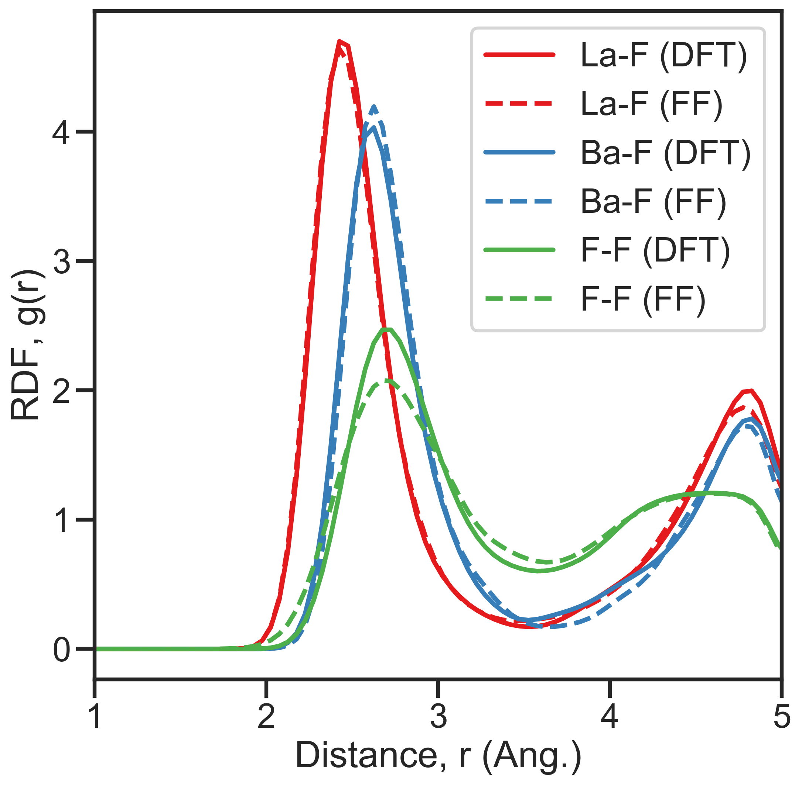
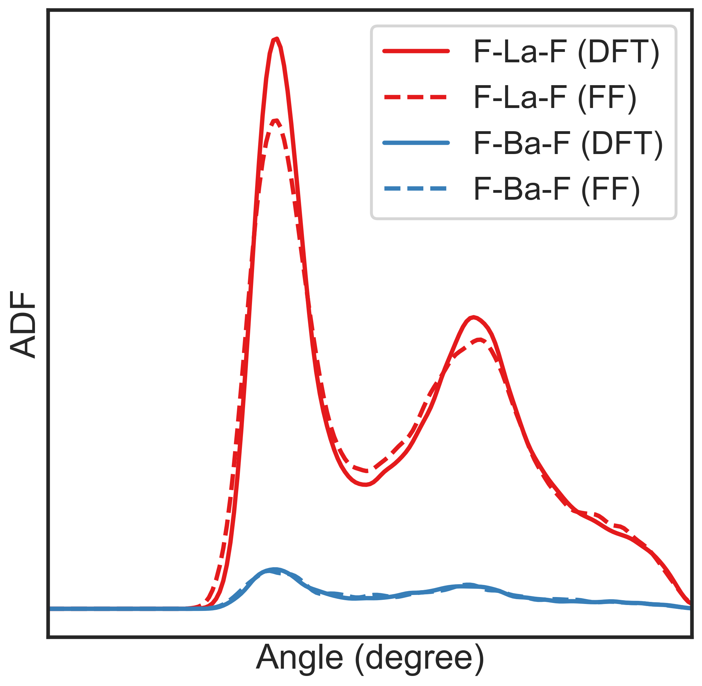

==============================
Analyzing simulation results
==============================

  #. :ref:`energy`
  #. :ref:`visualize`
  #. :ref:`voronoi`
  #. :ref:`rdf`
  #. :ref:`adf`
  #. :ref:`power-spectrum`

--------

.. _energy:

Evolution of energies
========================
Energies are basic values in MD.
If you perform *NVE* simulation in which no damping, temperature control, nor external forces,
the total energy has to be conserved whereas kinetic and potential energies fluctuate.
This is often used to check the validity of forces on atoms when programming new potentials.

When one performs structure relaxation by damping velocities of atoms,
as MD steps increase the kinetic energy has to decrease to zero.

When one performs constant temperture simulation, 
kinetic energy should be almost constant during the simulation.

Since total, kinetic, and potential energies are written in ``out.erg`` file,
users can plot energy evolution using ``gnuplot`` command as,
::  

  $ gnuplot
  gnuplot> plot 'out.erg' us 1:3 w l t 'total', 'out.erg' us 1:4 w l t 'kinetic', 'out.erg' us 1:5 w l t 'potential'

Or copy ``util/gp.erg`` script to the working directory and,
::

  gnuplot> load 'gp.erg'

--------

.. _visualize:

Visualization of atom configuration
==============================================

Convert from *pmd*-format files
-----------------------------------

There is a conversion program that changes from pmd format to visualization software format.
When visualizing the atom configuration by using `Ovito <https://www.ovito.org>`_ ,
first convert the *pmd*-format files, ``pmd_###`` , to *LAMMPS-dump* format files by doing the following,
::

  $ /path/to/nap/nappy/napsys.py convert --specorder=A,B,C pmd_#### dump_####

where ``--specorder=A,B,C`` specifies the order of species used in the pmd-format file.
Then you get ``dump_####`` file where ``####`` should be a 4-digit number.
The `Ovito <https://www.ovito.org>`_ can open the LAMMPS-dump format file.

If there are sequential ``pmd_####`` files, one can convert those files by using bash for-statement as
::

  $ for f in pmd????; do /path/to/nap/nappy/napsys.py convert \
      --specorder=A,B,C $f `echo $f | sed 's/pmd/dump/'`; done

Write *LAMMPS-dump* file directly
-------------------------------------
If you set ``flag_out_pmd`` as ``2``, the ``pmd`` program writes atomic configurations in *LAMMPS-dump* format
with file names ``dump_####``.
So you can visualize those files without any conversion using *Ovito* or some other programs that can visualize *LAMMPS-dump* file.

--------

.. _voronoi:

Voronoi analysis
=================
The other way to analyze the local structure is **Voronoi analysis** which makes a cell which contains one atom
according to the rule; the minimum cell made of faces that bisect atom bonds.

To perform Voronoi analysis, you need to instal ``voro++`` first, and then 
::

  $ python /path/to/nap/nappy/voro.py pmd_####

This command will provide an output ``pmd_####.voro`` and ``pmd_####.voro.vol`` which are
input and output of ``voro++``, respectively.

--------

.. _rdf:

Radial distribution function (RDF)
===================================
**RDF** is also commonly used analysis teqnique.

To get the RDF,
::

   $ python /path/to/nap/nappy/rdf.py [options] dump_0*

then, you get averaged RDF over atoms in ``out.rdf``.

Given atom configuration files, ``dump_####``, are read and average over atoms in those files are taken.

Options are shown below,
::

   Options:
     -h, --help  Show this help message and exit.
     -d DR       Width of the bin. [default: 0.1]
     -r RMAX     Cutoff radius of radial distribution. [default: 5.0]
     --gsmear=SIGMA
                 Width of Gaussian smearing, zero means no smearing. [default: 0]
     -o OUT      Output file name. [default: out.rdf]
     --specorder=SPECORDER
                 Order of species separated by comma, like, --specorder=W,H. [default: None]
     --skip=NSKIP 
                 Skip first NSKIP steps from the statistics. [default: 0]
     --no-average
                 Not to take average over files.
     --no-normalize
                 Not to normalize by the density.
     --plot      Plot figures. [default: False]

The RDF of each pair of species normalized with the density of the pair.

----------------

.. _adf:

Angular distribution function (ADF)
====================================

To get ADF, perform ``adf.py`` something like,
::

   $ python /path/to/nap/nappy/adf.py --triplets=La-F-F,Ba-F-F dump_0*

The triplets consisting angles must be provided via the option ``--triplets``. 
Note that the 1st species in the triplet is the central atom having bonds to the other two atoms, which maybe counter-intuitive.

Here is some options of ``adf.py``,
::

   Options:
     -h, --help  Show this help message and exit.
     -w DEG      Width of the angular degree. [default: 1.0]
     -r RCUT     Cutoff radius of the bonding pair. [default: 3.0]
     --gsmear=SIGMA
                 Width of Gaussian smearing, zero means no smearing. [default: 0]
     --triplets=TRIPLETS
                 Triplets whose angles are to be computed. Three species should be specified connected by hyphen,
                 and separated by comma, e.g.) P-O-O,Li-O-O. [default: None]
     -o OUT      Output file name [default: out.adf]
     --skip=NSKIP 
                 Skip first NSKIP steps from the statistics. [default: 0]
     --no-average
                 Not to take average over files.
     --plot      Plot figures. [default: False]

----------------

.. _power-spectrum:

Velocity autocorrelation and power spectrum
===========================================

.. note::

  The file format used in this section, **akr**, is not used since years before. So the explanation here would not work correctly. We do not remove this section because somebody might be interested in the procedure used here...

In order to get power spectrum from the MD simulation result, firstly we have to think how long the MD simulation has to be run.
In case of Si, its phonon DOS exists up to about 16~18 THz which is the inverse of time interval of sampling data.
And the frequency resolution is the inverse of simulation time.
So the time interval of sampling data should be about 20 fs (which corresponds to 25 THz since the half of data will be omitted because of the symmetry.)
And the simulation time should be 10,000 fs which corresponds to the frequency resolution 0.1 THz.
Usually, one has to make about **1,000 akr files** for the power spectrum calculation.

To get the velocity autocorrelation and power specturm, you can use ``power_spectrum.py`` in ``nappy`` directory.
::

  $ python /path/to/nap/nappy/power_spectrum.py -t 20.0 --relax 5000.0 akr0???

Here ``-t`` option specifies the time interval between successive akr files.
``--relax`` specifies relaxation time of the decaying factor for autocorrelation function, if this is omitted no decaying factor is applied..
The you get ``dat.autocorr`` and ``dat.power`` files.
``dat.autocorr`` includes velocity autocorrelation functions of *x*, *y*, *z*, and sum of those.
``dat.power`` also includes power spectrums of *x*, *y*, *z*, and sum of those.

If this power spectrum graph seems too spiky, you can smear it by using ``gaussian_smear.py`` as,
::

  $ python /path/to/nap/nappy/gaussian_smear.py -x 1 -y 5 -s 2.0 dat.power

Then you get ``dat.power.smeared`` file which contains only 2 columns of blurred data of 1st and 5th columns of ``dat.power``.

