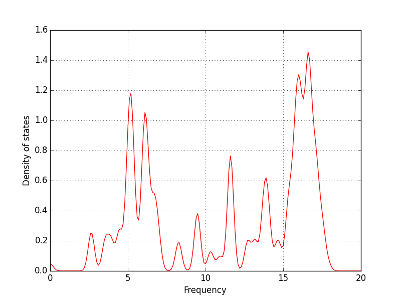

.. _example:

=========
Examples
=========

* :ref:`relaxation`
* :ref:`lattice-constant`
* :ref:`elastic-constants`
* :ref:`phonon-dispersion`
* :ref:`heat-flux`

-----------------------------

.. _relaxation:

Structure relaxation
======================
In general, the atom configuration made systematically using ``mkconf_*`` may not be most stable structure and one needs to relax the structure.
To relax the strucure, you can run MD simulation with **FIRE algorithm** as,

* without controlling temperature ( ``temperature_control`` to be ``none``);
* with applying velocity damping ( ``flag_damping`` to be ``2`` to use **FIRE**);
* with convergence criterion 1.0e-4 eV ( ``converge_eps`` to be ``1.0d-4`` ).

Then atoms move towards the direction where the forces on atoms indicate with 
reducing their energies, and finally the system becomes the least energy structure.

After relaxing the structure with some outputs,
use the relaxed structure as the initial structure of the next simulation as,
:: 

  $ mv pmdini pmdorig     <== save initial structure to pmdini
  $ mv pmdfin pmdini      <== replace pmdini with pmdfin (relaxed structure)

------------------------------

.. _lattice-constant:

Lattice constant and bulk modulus
============================================
In order to calculate lattice constant and bulk modulus,
we have to change lattice size and evaluate potential energy of the system.
The lattice size that minimizes the potential energy is the lattice constant,
and curvature around the lattice constant corresponds to the bulk modulus.

1. Prepare a small simulation cell of the system.

2. Make ``pmdini`` file.

3. Set ``num_iteration`` value in ``in.pmd`` file to zero. (Because only the 1st evaluation of the potential energy and forces are required.)

4. Perform test run of *pmd* as,
   ::
  
     $ /path/to/pmd/pmd
  
   And confirm that *pmd* was done correctly.

5. Run the script as,
   ::
  
     $ /path/to/nap/nappy/energy_vs_size.py 3.1  3.3
  
   where 3.1 and 3.3 are the min and max value of lattice size.
   Then you get the following output and graph.
   ::
  
         3.1000   804.3570    -455.5304887
         3.1100   812.1662    -457.0570473
         3.1200   820.0259    -458.4111792
         3.1300   827.9360    -459.6000610
         3.1400   835.8969    -460.6305856
         3.1500   843.9086    -461.5093734
         3.1600   851.9714    -462.2420295
         3.1700   860.0854    -462.8289708
         3.1800   868.2507    -463.2688466
         3.1900   876.4675    -463.5607352
         3.2000   884.7360    -463.7041313
         3.2100   893.0563    -463.6989250
         3.2200   901.4287    -463.5453811
         3.2300   909.8532    -463.2441193
         3.2400   918.3300    -462.7960993
         3.2500   926.8594    -462.2027522
         3.2600   935.4414    -461.4659414
         3.2700   944.0761    -460.5877459
         3.2800   952.7639    -459.5704416
         3.2900   961.5048    -458.4164932
         3.3000   970.2990    -457.1285461
     plsq= [   1.8861122     1.58686615  888.41535225 -463.71506645]
    =============================== RESULTS ================================
     Lattice constant =     3.2044 Ang.
     Cohesive energy  =     -8.587 eV
     Bulk modulus     =     302.16 GPa
    ================================ OUTPUT ================================
     * out.Ecoh-vs-size
     * log.Ecoh-vs-size.eps
  
   Then you can make a graph using some plotting program like ``gnuplot`` with the ``out.energy_vs_size`` file.

   .. image:: ./figs/Ecoh-vs-size.png
  
------

.. _elastic-constants:

Elastic constants
====================
By applying cell deformations which correspond to the elastic constants you want to calculate,
you can obtain elastic constants by calculating potential energy for each deformed structure.
(Note that this script works only for cubic systems.)

And here it is assumed that :ref:`lattice-constant` is done,
and the lattice constant is alreadly obtained.

1. Set the lattice constant in ``pmdini`` file to the value obtained in :ref:`lattice-constant` .

2. Run the script as follows, then you can get the following outputs and graph.
   ::
  
    $ calc-elastic-constants.py
         0.0000    -222.6114952    -222.6114952    -222.6114952
         0.0010    -222.6110355    -222.6111095    -222.6112676
         0.0020    -222.6096187    -222.6099522    -222.6105848
         0.0030    -222.6072423    -222.6080232    -222.6094468
         0.0040    -222.6039040    -222.6053225    -222.6078536
         0.0050    -222.5996012    -222.6018497    -222.6058052
         0.0060    -222.5943316    -222.5976044    -222.6033015
         0.0070    -222.5880928    -222.5925864    -222.6003426
         0.0080    -222.5808824    -222.5867951    -222.5969284
         0.0090    -222.5726978    -222.5802299    -222.5930588
         0.0100    -222.5635369    -222.5728903    -222.5887338
    =============================== RESULTS ================================
     C11     =    244.481 GPa
     C11-C12 =     98.392 GPa
     C12     =    146.089 GPa
     C44     =    116.030 GPa
     Following values maybe only valid for isotropic materials...
     Young's modulus =    215.743 GPa
     Poisson's ratio =      0.203
     shear modulus   =     89.698 GPa
    ================================ OUTPUT ================================
     * out.elastic-constants
     * graph.elastic-constants.eps

   .. image:: ./figs/graph_elastic-constants.png

--------

.. _phonon-dispersion:

Phonon dispersion using phonopy
===============================
Phonon dispersion relation can be calculated using `phonopy <http://phonopy.sourceforge.net>`_ program. 
So you have to install *phonopy* before moving forward in this topic.

First, prepare the atom configuration file for pmd ``pmdini`` which contains cell structure and atom positions. 
Generally this should be the primitive unit cell of the crystall structure you are considering now.

.. warning::

  Following approach, making **FORCE_CONSTANTS**, is an old fashion way. 
  See pmd2phonopy_ , you can run only one command to get the phonon dispersion relation.

2nd, run the following command to get the **force constansts** via finite displacement approach as,
::

   $ python /path/to/nap/nappy/force_constant.py -d 0.0001 -r 3.772 pmdini

You get ``POSCAR`` and ``FORCE_CONSTANTS`` to be used by ``phonopy`` program.
The option with ``-d`` means the magnitude of displacement in Angstrom, and ``-r`` for cutoff radius of the interatomic potential used.
``force_constant.py`` will show an output as following,
::

    displacement =  0.0001  Ang.
    rcut         =  3.772  Ang.
    POSCAR was written.
    vol of unit cell= 40.0456573564
    num of cells in each axis= 5 5 5
    num of atoms in extended system= 250
    sysext.num_atoms()= 250

It means that the ``FORCE_CONSTANTS`` file contains 5x5x5 cells of the original primitive unit cell. 
This values will be passed to phonopy below.

3rd, prepare a configuration file for ``phonopy`` (here it is named as ``conf.phonopy``).
::

   ATOM_NAME = Si
   CELL_FILENAME = POSCAR
   CREATE_DISPLACEMENTS = .FALSE.
   FORCE_CONSTANTS = READ
   DIM = 5 5 5
   BAND = 0 0 0  1/2 1/2 0  1/2 1/2 1/2  1/2 0 0  0 0 0

Here ``DIM`` should be the same as the values above.
And ``FORCE_CONSTANTS = READ`` let phonopy read force constants from the file ``FORCE_CONSTANTS``.
Running phonopy with specifying this ``conf.phonopy`` as input,
::

   $ phonopy -p conf.phonopy

you can get phonon dispersion graph as following.

.. image:: ./figs/phonon-dispersion-Si.png

If you specify the phonopy configuration file like,
::

   ATOM_NAME = Si
   CELL_FILENAME = POSCAR
   CREATE_DISPLACEMENTS = .FALSE.
   FORCE_CONSTANTS = READ
   DIM = 5 5 5
   MP = 5 5 5
   DOS_RANGE = 0 20 0.1
   SIGMA = 0.2

You can get a phonon DOS.

.. _pmd2phonopy:

pmd2phonopy.py to get the phonon dispersion directory
------------------------------------------------------

Above approach, in which ``FORCE_CONSTANTS`` are obtained, is old fashion and lengthy.
Now users can get the phonon dispersion relation directory with one command.

First, prepare ``pmdini`` and ``band.conf`` files.
``band.conf`` file should be like the following:
::

  ATOM_NAME = Si
  DIM =  4  4  4
  BAND = 0 0 0  1/2 0 1/2,  1/2 1/2 1  0 0 0  1/2 1/2 1/2

Here ``ATOM_NAME`` is necessary if you want to get correct frequency values in phonon dispersion graph.
Only phonon frequencies correspond to the wave numbers given by ``BAND`` parameters are shown.

Users do not need to consider ``DIM``, these values are automatically determined in the following command.

.. code-block:: bash

  $ python /path/to/pmd2phonopy.py -c 4.0 pmdini

Then you can get a band output file ``out_band``, so you can see a graph with ``gnuplot`` as,

.. code-block:: bash

  $ gnuplot
  gnuplot> plot "out_band" us 1:2 w l

--------

.. _heat-flux:

Non-equilibrium molecular dynamics (NEMD) for heat flux
=======================================================
One can perform NEMD heat flux simulation applying different temperatures at different regions.
The figure below shows a setting of heat-flux NEMD simulation.

.. image:: ./figs/NEMD-setting.png

Heat flux must be flown along *x*-direction.
In this case, at both left and right side of the system, atoms are fixed during simulation.
And vacuum region is placed in order to avoid interactions between hot and cool atoms.

The digits at the bottom of above picture are *ifmv* values.
The *ifmv* values of fixed atoms should be 0, hot atoms to be 2, cool atoms 3, intermediate atoms 1.
And the temperature setting in ``in.pmd`` is like following,
::

   initial_temperature     -600d0
   temperature_control     Berendsen
   temperature_target   1  -300d0
   temperature_target   2  350d0
   temperature_target   3  250d0
   temperature_relax_time  100d0
   factor_direction 3 3
     1.000d0  1.000d0  1.000d0
     1.000d0  1.000d0  1.000d0
     1.000d0  1.000d0  1.000d0  

Target temperatures of hot and cool atoms are 350 K and 250 K.
Whereas the target temperature of intermediate atoms are not set and the value is set negative.

Temperature distribution along *x* is obtained by specifying as follows in ``in.pmd``,
::

   flag_temp_dist  T
   num_temp_dist  50

which means setting flag ``.true.`` and the number of bins along *x* is 50.
The ``num_temp_dist`` value must be a multiple of ``num_nodes_x``.
Results will be written in ``out.temp-dist``.
The ``out.temp-dist`` file contains temperatures of 50 points of every ``num_iteration``/ ``num_out_energy`` steps.

